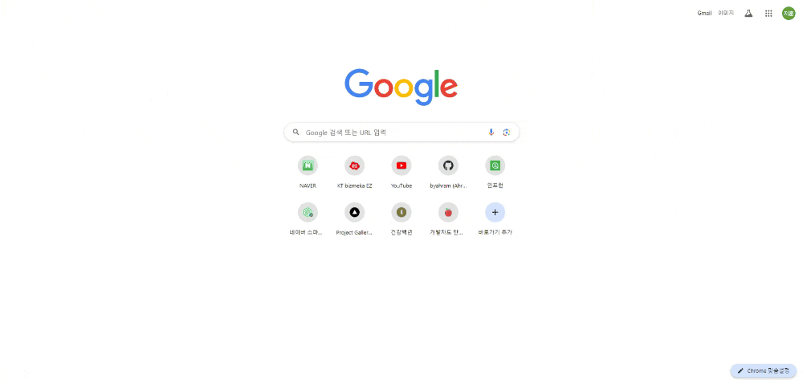

# NEXT-UI-TEMPLATE

## 1. Infinite Text Move on Scroll

<https://github.com/byahram/next-ui-template/tree/master/infinite-text-move-on-scroll>

    
    &nbsp;
    
    &nbsp;
    
    &nbsp;

 

## 2. Project Gallery Mouse Hover

<https://github.com/byahram/next-ui-template/tree/master/project-gallery-mouse-hover>

    
    &nbsp;
    
    &nbsp;
    
    &nbsp;
    
    &nbsp;

 
