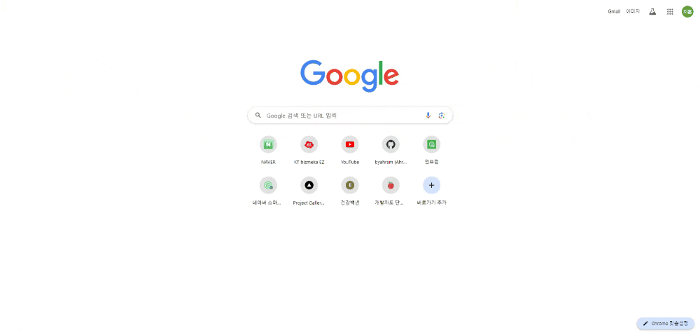
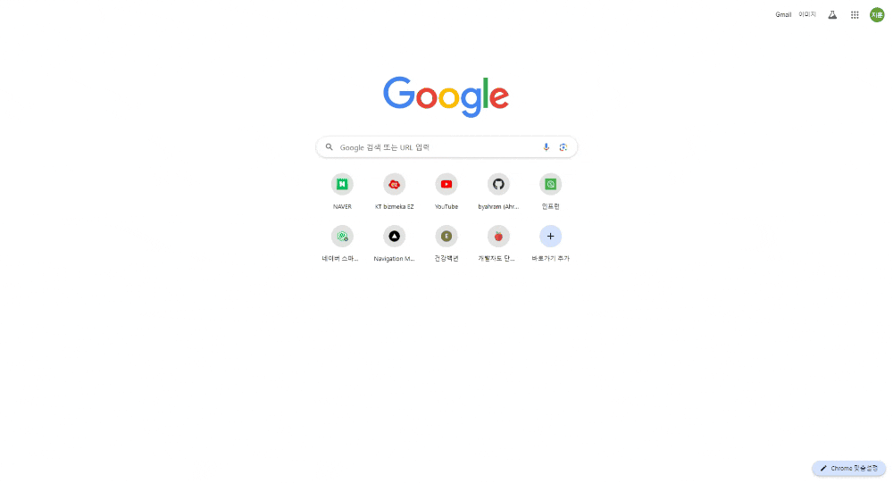

# NEXT-UI-TEMPLATE

## 01. Infinite Text Move on Scroll

<https://github.com/byahram/next-ui-template/tree/master/infinite-text-move-on-scroll>

    
    &nbsp;
    
    &nbsp;
    
    &nbsp;

 

## 02. Project Gallery Mouse Hover

<https://github.com/byahram/next-ui-template/tree/master/project-gallery-mouse-hover>

    
    &nbsp;
    
    &nbsp;
    
    &nbsp;
    
    &nbsp;

 

## 03. Text Parallax

<https://github.com/byahram/next-ui-template/tree/master/03-text-parallax>

    
    &nbsp;
    
    &nbsp;
    
    &nbsp;
    
    &nbsp;

 

## 04. Navigation Menu

<https://github.com/byahram/next-ui-template/tree/master/04-navigation-menu>

    
    &nbsp;
    
    &nbsp;
    
    &nbsp;
    
    &nbsp;
    
    &nbsp;

 
